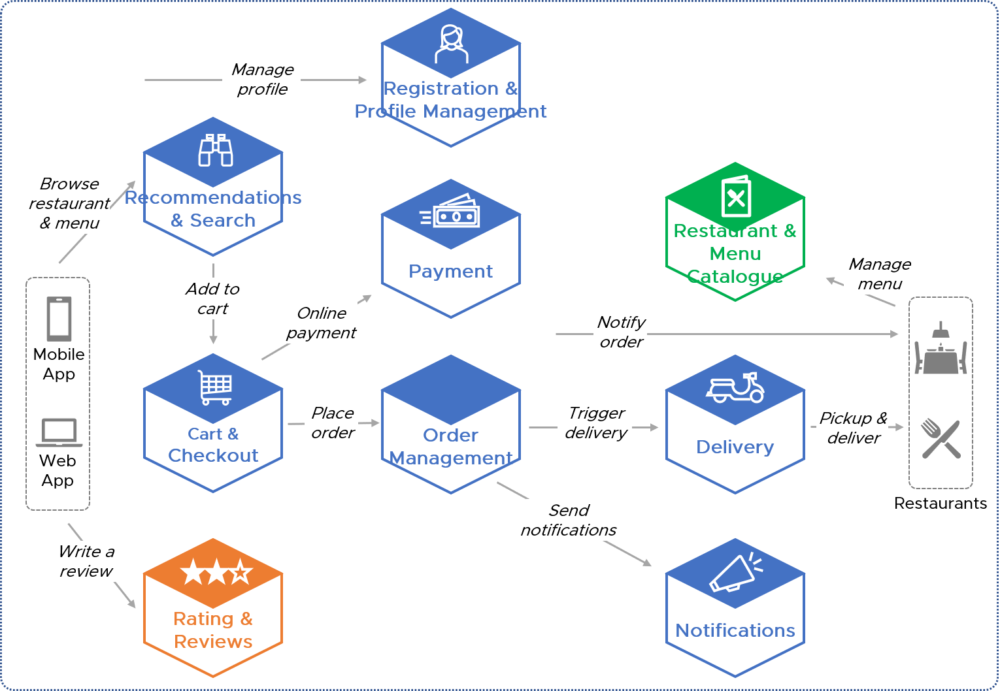
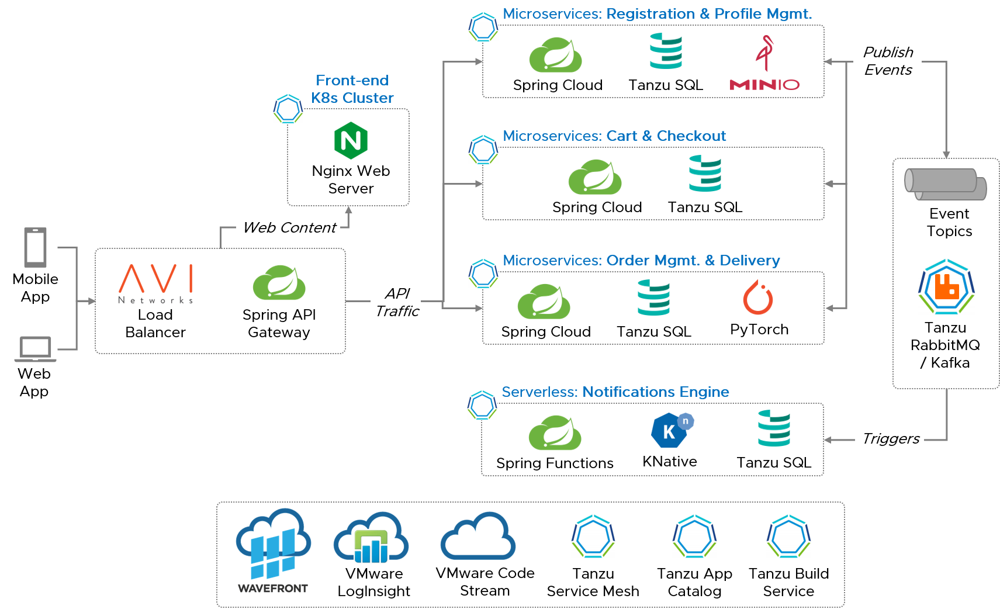
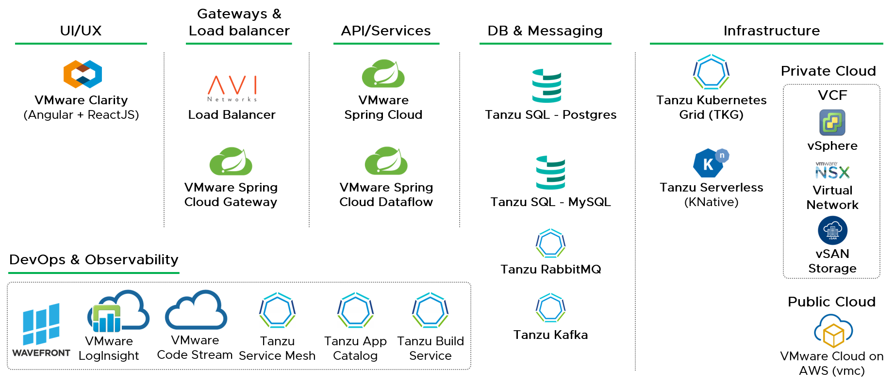

<p align="center">
    <a href="https://circleci.com/" alt="Builds">
        </a>
    <a href="" alt="Tests">
        </a>
    <a href="" alt="">
        </a>
    <a href="" alt="">
        </a>
    <a href="" alt="">
        </a>
</p>
<p align="center">
    <a href="" alt="GitHub followers">
        </a>
    <a href="" alt="GitHub forks">
        </a>
    <a href="" alt="GitHub forks">
        </a>
</p>

# :hamburger:Food Delivery App:motor_scooter: - using VMWare Multi-Cloud Technologies & SaaS Services
A _solution blueprint_ (or) _reference model_ to implement a fictitious Food Delivery App using *VMware*’s hybrid & multi-cloud technologies such as Tanzu(Kubernetes) & Cloud SaaS services.

_This sample application demonstrates how to build, run & manage a cloud-native modern application using VMware technology stack which is hosted on Priviate Cloud (Datacenter) and Public Clouds._
<p align="center">
    
    <!---->
</p>

>Note: This is a prototype, in particular demonstrates building real-world modern applications end-to-end using VMware technology stack. Kindly treat it as a reference model to build real-world applications.

You can standup working application within :alarm_clock: 30 minutes!

## Conceptual Architecture
This sample application includes following **functional modules/components** which are implemented as **Microservices** (or) **Serverless** functions. All these microservices are independently deployable & scalable services and are organized around business capabilities.
<p align="center">
    
</p>

## Technical Architecture
This sample application adhers to **API-driven** & **Event-Driven** architecture principles, wherein each fuctional module realized into a Cloud-Native application either as a **Serverless Functions** (or) **Microservices**. Each module/service is independently scalable and can be deployed as **Containers** anywhere (private & public clouds) using **VMware Tanzu** (Kubernetes).
<p align="center">
    
</p>

### Technology Stack
<p align="center">
    
</p>

#### Compute
- Tanzu Serverless functions - https://tanzu.vmware.com/serverless
- Tanzu Kubernetes Grid (TKG) - https://tanzu.vmware.com/kubernetes-grid
- VMware Hybrid Cloud Foundation - https://www.vmware.com/products/cloud-foundation.html
#### Storage & Database
- Tanzu SQL for Postgress - https://tanzu.vmware.com/content/blog/vmware-tanzu-sql-now-ga-kubernetes-postgres
- MinIO Open Source Object Storage - https://min.io/
#### Messaging
- Tanzu RabbitMQ - https://tanzu.vmware.com/rabbitmq
- Kafka - https://tanzu.vmware.com/developer/guides/messaging-and-integration/kafka-gs/
#### Observability & DevOps
- Tanzu Observability Cloud (Wavefront) - https://tanzu.vmware.com/observability
- VMware vRealize Log Insight Cloud - https://cloud.vmware.com/log-insight-cloud
- Tanzu Application Catalog - https://tanzu.vmware.com/application-catalog
- Tanzu Build Service - https://tanzu.vmware.com/build-service
- Tanzu Mission Control - https://tanzu.vmware.com/mission-control

## Getting Started

### Pre-requisites
To standup this sample application in your environment (private cloud or public cloud), as a pre-requisite you must have following up & ready,
- TODO
- TODO

### Installation Instructions
#### Clone Repository
Clone respository source code by issuing below instruction from any folder on your machine,
```sh
git clone https://github.com/venkataravuri/e-commerce-microservices-sample.git
cd e-commerce-microservices-sample
```
#### Build Application(s)
Maven/Gradle has been used as a build tool to build applications. Issue following command on your terminal/console window,
```sh
gradlew build
```
#### Provision Infratructure & Deploy Application(s)
##### Configuration
Modify below configuration settings to match your environment,
- TODO
- TODO

Execute below Terraform instruction in sequence to provision infrastructur and ,
```sh
TODO
```

## Further Reading
For further information on this sample application, reach us on Slack #TODO
